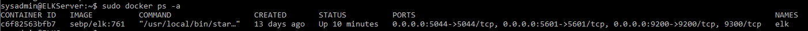

## Automated ELK Stack Deployment

The files in this repository were used to configure the network depicted below.


These files have been tested and used to generate a live ELK deployment on Azure. They can be used to either recreate the entire deployment pictured above. Alternatively, select portions of the <b>yml</b> file may be used to install only certain pieces of it, such as Filebeat.

[Filebeat Playbook](./Ansible/filebeat-playbook.yml)

[Metricbeat Playbook](./Ansible/metricbeat-playbook.yml)

[Elk Install](./Ansible/install-elk.yml)

This document contains the following details:
- Description of the Topologu
- Access Policies
- ELK Configuration
  - Beats in Use
  - Machines Being Monitored
- How to Use the Ansible Build


### Description of the Topology

The main purpose of this network is to expose a load-balanced and monitored instance of DVWA, the D*mn Vulnerable Web Application.

Load balancing ensures that the application will be highly <b>available</b>, in addition to restricting <b>traffic</b> to the network.

What aspect of security do load balancers protect?
- <b>A load balancer defends an organization against distributed denial-of-service (DDoS) attacks. It does this by shifting attack traffic from the corporate server to a   public cloud provider.</b>

What is the advantage of a jump box?
- <b>A jump box is a secure computer that you will first connect to before connecting to other servers or untrusted environments.</b>

Integrating an ELK server allows users to easily monitor the vulnerable VMs for changes to the <b>data</b> and system <b>logs</b>.

What does Filebeat watch for?
- <b>Filebeat monitors the log files or locations that you specify, collects log events, and forwards them either to Elasticsearch or Logstash for indexing.</b>

What does Metricbeat record?
- <b>Metricbeat takes the metrics and statistics that it collects and ships them to the output that you specify, such as Elasticsearch or Logstash. Metricbeat helps you monitor your servers by collecting metrics from the system and services running on the server, such as: Apache.
</b>

The configuration details of each machine may be found below.
_Note: Use the [Markdown Table Generator](http://www.tablesgenerator.com/markdown_tables) to add/remove values from the table_.

| Name     | Function | IP Address | Operating System |
|----------|----------|------------|------------------|
| Jump Box | Gateway  | 10.0.0.1   | Linux            |
| Web-1    | Server   | 10.0.0.8   | Linux            |
| Web-2    | Server   | 10.0.0.9   | Linux            |
| Elk      | Server   | 10.1.0.4   | Linux            |

### Access Policies

The machines on the internal network are not exposed to the public Internet. 

Only the <b>jump box provisioner</b> machine can accept connections from the Internet. Access to this machine is only allowed from the following IP addresses:
- <b>My public IP address</b>

Machines within the network can only be accessed by <b>the jump box provisioner through ssh</b>.

Which machine did you allow to access your ELK VM? 
-  <b>Jump Box Provisioner</b>

What was its IP address?_
-  <b>IP address: 10.1.0.4:5601</b>
  
A summary of the access policies in place can be found in the table below.

| Name     | Publicly Accessible | Allowed IP Addresses |
|----------|---------------------|----------------------|
| Jump Box | Yes                 | Personal IP          |
| Web-1    | No                  | 20.187.67.120        |
| Web-2    | No                  | 20.187.67.120        |
| Elk      | No                  | 20.213.90.251        |

### Elk Configuration

Ansible was used to automate configuration of the ELK machine. No configuration was performed manually, which is advantageous because...
What is the main advantage of automating configuration with Ansible?

- <b>Using Playbooks in Ansible is one of maine advantages of Ansible. Playbooks are Ansible configuration files, and the language for writing them is YAML.</b> 

The playbook implements the following tasks:
In 3-5 bullets, explain the steps of the ELK installation play. E.g., install Docker; download image; etc._

- Install Docker to the ELK server, Install docker.io, python3-pip, and Docker module 
```javascript
---
- name: Configure Elk VM with Docker
  hosts: elk
  become: true
  tasks:
   - name: Install docker.io
      apt:
        update_cache: yes
        force_apt_get: yes
        name: docker.io
        state: present
    - name: Install python3-pip
      apt:
        force_apt_get: yes
        name: python3-pip
        state: present
    - name: Install Docker module
      pip:
        name: docker
        state: present
```
- Increase the virtual memory
```Javascript
    - name: Increase virtual memory
      command: sysctl -w vm.max_map_count=262144
    - name: Use more memory
      sysctl:
        name: vm.max_map_count
        value: "262144"
        state: present
        reload: yes
```
- Download and launch Docker ELK container to run on ports 5601,9200,5044
```Javascript
    - name: download and launch a docker elk container
      docker_container:
        name: elk
        image: sebp/elk:761
        state: started
        restart_policy: always
        published_ports:
          - 5601:5601
          - 9200:9200
          - 5044:5044
    - name: Enable service docker on boot
      systemd:
        name: docker
        enabled: yes
```

The following screenshot displays the result of running `docker ps` after successfully configuring the ELK instance.



### Target Machines & Beats
This ELK server is configured to monitor the following machines:
- <b>Web-1 IP Address:10.0.0.8</b>
- <b>Web-2 IP Address:10.0.0.9</b>

We have installed the following Beats on these machines:
- <b>Filebeat</b>
- <b>Metricbeat</b>

These Beats allow us to collect the following information from each machine:
In 1-2 sentences, explain what kind of data each beat collects, and provide 1 example of what you expect to see. E.g., `Winlogbeat` collects Windows logs, which we use to track user logon events, etc.

- <b>Filebeat monitors the log files or locations that you specify, collects log events, and forwards them either to Elasticsearch or Logstash for indexing. An example is the majority of traffic on a website by particular country</b>
- <b>Metricbeat helps you monitor your servers by collecting metrics from the system and services running on the server, such as: Apache. An example is Uptime Monitoring which checks the availability and the response time of your website and publicly accessible infrastructure.</b>

### Using the Playbook
In order to use the playbook, you will need to have an Ansible control node already configured. Assuming you have such a control node provisioned: 

SSH into the control node and follow the steps below:
- Copy the <b>yml</b> file to <b>ansible hosts</b>.
- Update the <b>ansible/hosts</b> file to include the <b>Elk and Web servers as well as the IP address for their VM</b>.
- Run the playbook, and navigate to <b>http://[ELK.VM.IP]:5601/app/kibana</b> to check that the installation worked as expected.

Which file is the playbook?

- [Filebeat Playbook](./Ansible/filebeat-playbook.yml)

- [Metricbeat Playbook](./Ansible/metricbeat-playbook.yml)

Where do you copy it?
- <b>etc/ansible/

Which file do you update to make Ansible run the playbook on a specific machine? How do I specify which machine to install the ELK server on versus which to install Filebeat on?_
- <b>Update the filebeat_config and metricbeat_config. You will update the etc/ansible/hosts to specify the servers and IP addresses for each machine.</b>

Which URL do you navigate to in order to check that the ELK server is running?
- <b>http://[your.ELK-VM.Public.IP]:5601/app/kibana.</b>

_As a **Bonus**, provide the specific commands the user will need to run to download the playbook, update the files, etc._
